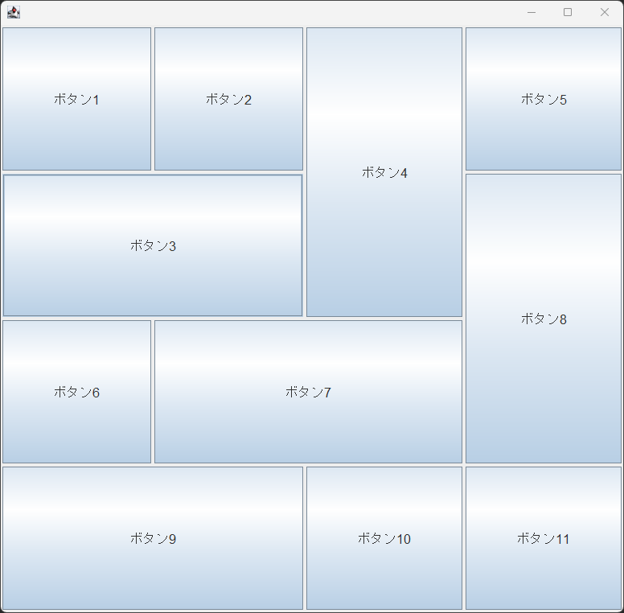

# 概要

職業訓練学校時代に、当時学んでいたJavaのSwingコンポーネントを使って、レスポンシブなボタン群を配置した画面を作ってみました。

# 作成日

2023年10月03日

# スクリーンショット

レスポンシブになっています。

# 補足

習作として実装したものの、実用性があるかどうかは分かりません。
これを実装するのに使用したSwingコンポーネントは、主にJavaによる業務アプリケーションのGUIインターフェースの実装に使用するもので、
業務アプリケーションはWeアプリケーションと異なり、ターゲットデバイスや画面サイズが固定されている場合が多く、レスポンシブにする必要性が少ないためです。
とはいえ、レスポンシブな画面は珍しいとのことで、担任の先生も面白がってくれました。